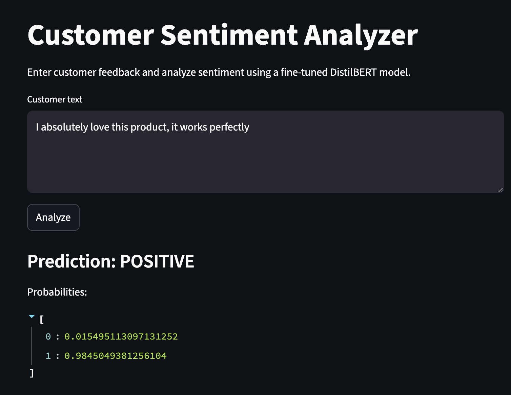

# Project Title
Customer Insights – End-to-End NLP Sentiment Analysis System

## What this project does

This is an End-to-end NLP system that trains, serves, and deploys a sentiment analysis model using DistilBERT. It includes data preprocessing, model training, evaluation, FastAPI inference API, and Dockerized deployment and Streamlit UI.

## Tech stack
- Python 3.10
- PyTorch + Hugging Face
- Scikit-learn
- FastAPI
- Docker 
- MLflow 


## Project structure
See `/src` for implementation and `/docs` for documentation.

## Architecture
This project follows a production-style, containerized architecture.


## Model Performance

| Model                     | F1 Score | Notes |
|---------------------------|----------|-------|
| TF-IDF + Logistic Reg     | 0.80     | Strong classical baseline |
| DistilBERT (fine-tuned)   | 0.896    | 2 epochs, Hugging Face Transformers |


## Project demo screenshot




### Components

- **Streamlit UI**
  - Collects user input
  - Sends requests to backend API
  - Displays predictions and probabilities

- **FastAPI Backend**
  - Loads trained DistilBERT model
  - Performs inference
  - Exposes REST endpoints (`/predict`, `/health`)

- **Docker & Docker Compose**
  - Isolated services
  - Internal networking
  - Environment-based configuration


## How to Run Locally (Docker)

### Prerequisites
- Docker Desktop
- Git

### Steps

```bash
git clone https://github.com/RaphSmart/customer-insights 
cd customer-insights
docker compose up --build
Then open:
Streamlit UI: http://localhost:8501
FastAPI API docs: http://localhost:8000/docs
Stop docker compose down